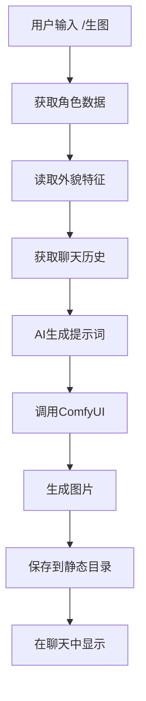

# AI图片生成功能

这个模块为AI角色扮演聊天系统添加了图片生成功能，用户可以通过简单的命令为角色生成相关的AI绘画。

## 功能特性

- 🎨 **智能提示词生成**: 基于角色外貌特征和聊天内容自动生成英文绘画提示词
- 🖼️ **ComfyUI集成**: 使用ComfyUI工作流进行高质量图片生成
- 💬 **聊天集成**: 直接在聊天界面使用`/生图`命令
- 🎭 **角色感知**: 自动读取角色数据书中的外貌特征信息
- 📱 **响应式显示**: 生成的图片以聊天气泡形式展示

## 系统架构

```
web/comfyui/
├── prompt_generator.py          # AI提示词生成器
├── image_generator.py           # 图片生成服务
├── image_generation_routes.py   # Flask路由处理
├── test_image_generation.py     # 测试脚本
├── 参考/                        # ComfyUI参考实现
│   ├── comfyui_client.py       # ComfyUI客户端
│   ├── example_usage.py        # 使用示例
│   └── LL杰出.json             # 工作流配置
└── generated_images/            # 生成图片临时存储
```

## 安装和配置

### 1. 依赖要求

- ComfyUI服务器运行在 `127.0.0.1:8188`
- Python依赖: `requests`, `websocket-client`
- 已配置的AI模型（用于提示词生成）

### 2. ComfyUI设置

1. 下载并安装ComfyUI
2. 启动ComfyUI服务器: `python main.py --listen 127.0.0.1 --port 8188`
3. 确保工作流文件 `参考/LL杰出.json` 存在并可用

### 3. 项目集成

功能已自动集成到主应用中，无需额外配置。

## 使用方法

### 在聊天界面使用

1. 选择一个角色
2. 在聊天输入框中输入 `/生图`
3. 系统将自动：
   - 读取角色的外貌特征
   - 分析最近的聊天内容
   - 生成英文绘画提示词
   - 调用ComfyUI生成图片
   - 在聊天中显示结果

### 使用快捷命令

1. 在聊天输入框中输入 `/`
2. 从命令列表中选择 "生图" 或 "generate-image"
3. 按Enter执行

## 工作流程



## API接口

### `/api/generate_image` (POST)

生成图片的主要API接口。

**请求参数:**
```json
{
    "role_name": "角色名称",
    "additional_context": "额外上下文信息",
    "generation_params": {
        "width": 768,
        "height": 768,
        "steps": 25,
        "cfg": 7.5,
        "negative_prompt": "low quality, blurry"
    }
}
```

**响应格式:**
```json
{
    "success": true,
    "message": "生成成功消息",
    "image_paths": ["/static/generated_images/image1.png"],
    "prompt": "生成的英文提示词",
    "generation_params": {...}
}
```

### `/api/image_service_status` (GET)

获取图片生成服务状态。

### `/api/test_comfyui_connection` (GET)

测试ComfyUI服务器连接。

## 配置文件

### 角色配置 (角色/角色名.yml)
```yaml
tags: []
voice_id: ''
介绍: '角色描述'
名字: 角色名
绑定数据书:
- 数据书名称
```

### 数据书配置 (数据书/数据书名.json)
```json
{
    "属性": {
        "外貌特征": {
            "发色": "金色",
            "瞳色": "蓝色",
            "身高": "165cm",
            "体重": "50kg",
            "特征": "总是穿着整洁的女仆装，头发梳成整齐的马尾辫"
        }
    }
}
```

## 测试和调试

### 运行测试脚本

```bash
cd web/comfyui
python test_image_generation.py
```

测试脚本将验证：
- ✅ 提示词生成器
- ✅ ComfyUI服务器连接
- ✅ 服务状态
- ✅ 命令处理器

### 常见问题排查

1. **ComfyUI连接失败**
   - 确保ComfyUI服务器正在运行
   - 检查端口8188是否被占用
   - 验证服务器地址配置

2. **提示词生成失败**
   - 检查AI模型配置
   - 确认角色数据书存在
   - 验证外貌特征数据格式

3. **图片生成失败**
   - 检查工作流文件是否存在
   - 确认ComfyUI模型加载正常
   - 查看ComfyUI服务器日志

4. **图片显示问题**
   - 确认静态目录权限
   - 检查图片文件路径
   - 验证web服务器配置

## 扩展开发

### 添加新的工作流

1. 在ComfyUI中创建新的工作流
2. 导出为JSON格式
3. 放置在 `参考/` 目录下
4. 修改 `ImageGenerationService` 中的 `workflow_path`

### 自定义提示词生成

修改 `PromptGenerator` 类中的 `generate_prompt` 方法来自定义提示词生成逻辑。

### 添加新的生成参数

在 `ImageGenerationService` 的 `generate_image_for_role` 方法中添加新的参数支持。

## 贡献指南

1. Fork项目
2. 创建功能分支
3. 提交更改
4. 创建Pull Request

## 许可证

本项目遵循项目主许可证。
